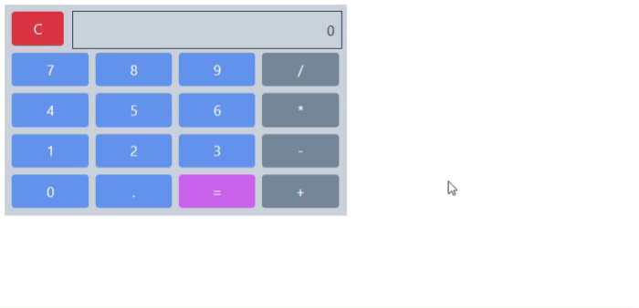

 	
#  Calculadora

Projeto demonstrativo apenas para prática de front end

<!--te-->

## Status

👍🏻 Finalizado

### Librarys 🛠
- [Rebassjs](https://rebassjs.org/button)

###  Demonstração 💻

#  Autor 👩🏻‍💻

Kátia Cibele  

[Linkedin](https://www.linkedin.com/in/k%C3%A1tia-cibele-33a2a971/)

